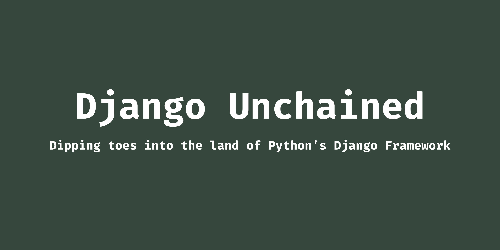

<div align="center">


# Django Unchained

</div>

## Description

This repo reflects my attempt to learn the Django framework from scratch. I'm adequately adept in Python and previously have done extensive micro-service oriented development via Flask, Starlette, FastAPI, etc. However, at the time of writing this, I don't have any prior experience of working with Django.

Initially, I'm not going through the official documentation or reading any tutorial in general. Instead, I'm working my way through these three books by [Willium S. Vincent](https://www.amazon.com/William-S-Vincent/e/B07B38Y8SG/ref=dp_byline_cont_book_1) in the following order:

* [Django for Beginners](https://www.amazon.com/Django-Beginners-Build-websites-Python/dp/1983172669)
* [Django for APIs](https://www.amazon.com/Django-APIs-Build-web-Python/dp/1093633948)
* [Django for Professionals](https://www.amazon.com/Django-Professionals-Production-websites-Python/dp/1081582162)


## Directory Orchestration

Here's a bird's eye view of all the completed projects. The top-level folders represent the name of the corresponding book, and each of the nested folders represents a single project.

```
.
├── django_for_apis
│   ├── project_1_library
│   ├── project_2_todo
│   └── project_3_blog
├── django_for_beginners
│   ├── project_1_hello_world
│   ├── project_2_pages_app
│   ├── project_3_mb_app
│   ├── project_4_blog_app
│   └── project_5_newspaper_app
├── django_for_professionals
│   ├── project_1_hello_world
│   ├── project_2_postgresql
│   └── project_3_bookstore
├── LICENSE
├── Makefile
├── README.md
├── requirements-dev.txt
└── requirements.txt

14 directories, 5 files
```

## Run the Final Project

You can run and play around with the final project of the Django for Professionals book. Follow the detailed instruction [here](https://github.com/rednafi/django-unchained/tree/master/django_for_professionals/project_3_bookstore) to do so.
